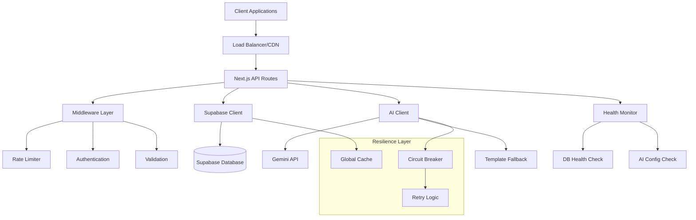
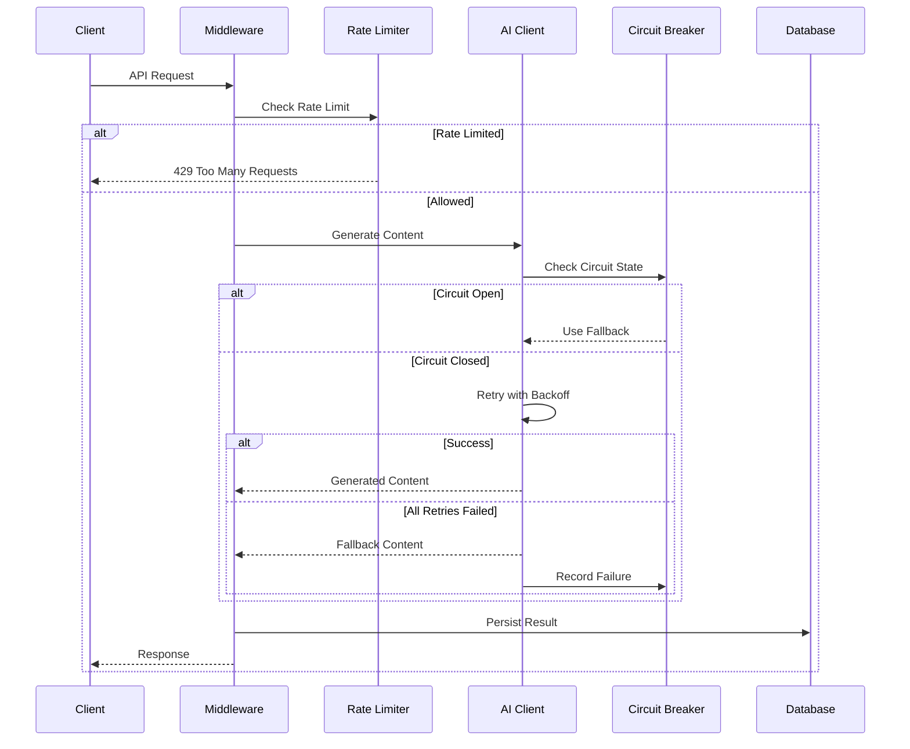

# Design Document

## Overview

This design outlines the implementation of critical infrastructure improvements for the CodeRed platform. The solution focuses on eight key areas: serverless optimization, AI resilience, rate limiting, health monitoring, test stability, comprehensive testing, audit trails, and security management. The design leverages existing patterns in the codebase while introducing new reliability mechanisms.

## Architecture

### High-Level Architecture



### Component Interaction Flow



## Components and Interfaces

### 1. Serverless-Safe Supabase Client

**Location**: `lib/supabase.ts` (enhanced)

**Key Changes**:
- Global client caching using `globalThis`
- TEST_MODE support for mock clients
- Health check utility function
- Proper error handling for missing credentials

**Interface**:
```typescript
export function getSupabaseAdmin(): SupabaseClient<Database>
export async function supabasePing(): Promise<{ ok: boolean; error?: string; info?: string }>
```

**Implementation Strategy**:
- Enhance existing global caching pattern
- Add TEST_MODE conditional logic
- Implement ping utility for health checks
- Maintain backward compatibility with existing code

### 2. Resilient AI Client

**Location**: `lib/gemini-client.ts` (new file)

**Key Features**:
- Retry mechanism with exponential backoff
- Circuit breaker pattern (30-second timeout)
- TEST_MODE mock responses
- Streaming and non-streaming support
- Template fallback system

**Interface**:
```typescript
export async function generateNudge(prompt: string, meta?: any): Promise<string>
export async function streamNudge(prompt: string, meta?: any): Promise<ReadableStream>
export function fallbackTemplate(learner: any, reason?: string): string
export function isCircuitOpen(): boolean
```

**Circuit Breaker Logic**:
- Track consecutive failures
- Open circuit after 3 failures
- Auto-reset after 30 seconds
- Immediate fallback when open

**Retry Strategy**:
- Maximum 3 attempts
- Exponential backoff: 1s, 2s, 4s
- Only retry on transient errors (5xx, network timeouts)

### 3. Rate Limiting Middleware

**Location**: `lib/rate-limit.ts` (new file)

**Features**:
- In-memory storage with automatic cleanup
- Per-IP and per-API-key limiting
- Configurable limits via environment variables
- Sliding window implementation

**Interface**:
```typescript
export function isRateLimited(key: string): {
  limited: boolean;
  remaining: number;
  resetAt: number;
}
export function getRateLimitKey(request: NextRequest): string
```

**Integration Points**:
- Middleware wrapper for API routes
- Applied to nudge endpoint initially
- Extensible to other endpoints

### 4. Health Monitoring Endpoint

**Location**: `app/api/health/route.ts` (new file)

**Health Checks**:
- Database connectivity (via supabasePing)
- AI service configuration presence
- System timestamp and version
- Overall status determination

**Response Format**:
```typescript
interface HealthResponse {
  status: 'ok' | 'degraded';
  db: { ok: boolean; error?: string };
  geminiConfigured: boolean;
  timestamp: string;
  version: string;
}
```

**Status Logic**:
- `ok`: All dependencies healthy
- `degraded`: Any dependency failing
- HTTP 200 for ok, 503 for degraded

### 5. Test Environment Stability

**Location**: Multiple component files

**Animation Control**:
- Environment-based motion reduction
- Framer Motion configuration override
- Playwright-friendly interactions

**Implementation**:
```typescript
// lib/animation.ts
export const shouldReduceMotion = process.env.TEST_MODE === 'true';

// Component usage
<motion.div animate={shouldReduceMotion ? {} : animationProps} />
```

### 6. Enhanced Nudge Endpoint

**Location**: `app/api/learners/[id]/nudge/route.ts` (enhanced)

**New Features**:
- Rate limiting integration
- Resilient AI client usage
- Enhanced audit trail
- Improved error handling

**Flow Enhancement**:
1. Rate limit check
2. Learner data fetch
3. AI generation with fallback
4. Audit trail persistence
5. Response formatting

## Data Models

### Enhanced Nudge Schema

```typescript
interface NudgeRecord {
  id: number;
  learner_id: number;
  text: string;
  status: 'sent' | 'fallback';
  source: 'gemini' | 'template';
  streamed: boolean;  // New field
  created_at: string;
}
```

### Rate Limit Storage

```typescript
interface RateLimitRecord {
  count: number;
  resetAt: number;
  windowStart: number;
}

// In-memory store
const rateLimitStore = new Map<string, RateLimitRecord>();
```

### Circuit Breaker State

```typescript
interface CircuitBreakerState {
  failures: number;
  lastFailureTime: number;
  state: 'closed' | 'open' | 'half-open';
}
```

## Error Handling

### Error Classification

1. **Transient Errors** (retry eligible):
   - Network timeouts
   - 5xx HTTP responses
   - Connection failures

2. **Permanent Errors** (no retry):
   - 4xx HTTP responses (except 429)
   - Authentication failures
   - Malformed requests

3. **Rate Limit Errors**:
   - 429 responses
   - Custom rate limit violations

### Error Response Format

```typescript
interface ErrorResponse {
  error: string;
  message: string;
  requestId: string;
  retryAfter?: number;  // For rate limits
  fallbackUsed?: boolean;
}
```

### Fallback Strategies

1. **AI Generation Failure**:
   - Template-based fallback
   - Personalized using learner data
   - Logged as 'template' source

2. **Database Failure**:
   - Graceful degradation
   - Error logging
   - User-friendly messages

3. **Configuration Missing**:
   - TEST_MODE allowances
   - Clear error messages
   - Fail-fast in production

## Testing Strategy

### Unit Tests

**Files to Create**:
- `tests/unit/supabase-client.test.ts`
- `tests/unit/gemini-fallback.test.ts`
- `tests/unit/rate-limit.test.ts`
- `tests/unit/circuit-breaker.test.ts`
- `tests/unit/risk-edge-cases.test.ts`

**Test Categories**:
1. **Supabase Client**:
   - Global caching behavior
   - TEST_MODE handling
   - Error scenarios

2. **AI Client**:
   - Retry logic
   - Circuit breaker states
   - Fallback generation
   - TEST_MODE mocks

3. **Rate Limiting**:
   - Limit enforcement
   - Window sliding
   - Key generation

4. **Risk Computation**:
   - Edge cases
   - Boundary conditions
   - Invalid inputs

### Integration Tests

**Files to Create**:
- `tests/integration/health.test.ts`
- `tests/integration/nudge-rate-limit.test.ts`
- `tests/integration/nudge-fallback.test.ts`
- `tests/integration/end-to-end-flow.test.ts`

**Test Scenarios**:
1. **Health Endpoint**:
   - All services healthy
   - Database failure
   - AI misconfiguration

2. **Nudge Generation**:
   - Rate limit enforcement
   - Fallback behavior
   - Audit trail creation

3. **End-to-End**:
   - Complete user flows
   - Error recovery
   - Performance validation

### E2E Test Stability

**Playwright Enhancements**:
- TEST_MODE environment setup
- Animation disabling
- Stable selectors
- Retry mechanisms

**Configuration**:
```typescript
// playwright.config.ts enhancement
use: {
  baseURL: process.env.TEST_MODE === 'true' ? 'http://localhost:3000' : undefined,
  // Reduced motion for stability
  reducedMotion: 'reduce',
}
```

## Security Considerations

### Environment Variable Management

**Required Variables**:
- `SUPABASE_URL`
- `SUPABASE_SERVICE_ROLE_KEY`
- `GEMINI_API_KEY`
- `ADMIN_API_KEY`
- `TEST_MODE` (for testing)

**Security Measures**:
- No secrets in repository
- `.env.example` with placeholders
- Runtime validation
- Secure defaults

### Rate Limiting Security

**Protection Against**:
- API abuse
- DDoS attacks
- Resource exhaustion
- Cost overruns

**Implementation**:
- IP-based limiting
- API key-based limiting
- Configurable thresholds
- Proper HTTP status codes

### Data Privacy

**Audit Trail**:
- No sensitive data in logs
- Anonymized error reporting
- Secure data persistence
- GDPR considerations

## Performance Considerations

### Serverless Optimization

**Cold Start Mitigation**:
- Global client caching
- Lazy initialization
- Connection reuse
- Minimal dependencies

**Memory Management**:
- Efficient data structures
- Garbage collection friendly
- Resource cleanup
- Memory leak prevention

### AI Service Optimization

**Cost Control**:
- Circuit breaker prevents cascading costs
- Rate limiting controls usage
- Fallback reduces API calls
- TEST_MODE eliminates dev costs

**Response Time**:
- Streaming for immediate feedback
- Parallel processing where possible
- Efficient retry strategies
- Local fallback generation

### Database Optimization

**Connection Management**:
- Single client instance
- Connection pooling
- Proper cleanup
- Health monitoring

**Query Efficiency**:
- Minimal data fetching
- Indexed queries
- Batch operations
- Caching strategies

## Deployment Strategy

### Branch Strategy

**Branch**: `kiro/priority-fixes-<timestamp>`

**Commit Strategy**:
- Small, focused commits
- Test-driven development
- Incremental rollout
- Rollback capability

### Environment Configuration

**Development**:
- TEST_MODE=true by default
- Mock services
- Local database
- Reduced logging

**Production**:
- Full service integration
- Enhanced monitoring
- Error alerting
- Performance tracking

### Rollout Plan

1. **Phase 1**: Infrastructure (Supabase, Health)
2. **Phase 2**: AI Resilience (Client, Fallback)
3. **Phase 3**: Rate Limiting
4. **Phase 4**: Testing Enhancements
5. **Phase 5**: Integration and Validation

## Monitoring and Observability

### Logging Strategy

**Log Levels**:
- ERROR: System failures, fallbacks used
- WARN: Retries, circuit breaker activations
- INFO: Normal operations, performance metrics
- DEBUG: Detailed troubleshooting (TEST_MODE)

**Key Metrics**:
- AI service success/failure rates
- Rate limit violations
- Circuit breaker activations
- Response times
- Fallback usage

### Health Monitoring

**Automated Checks**:
- Database connectivity
- AI service availability
- System resource usage
- Error rates

**Alerting**:
- Service degradation
- High error rates
- Resource exhaustion
- Security incidents

This design provides a comprehensive foundation for implementing the priority fixes while maintaining system reliability, performance, and security.