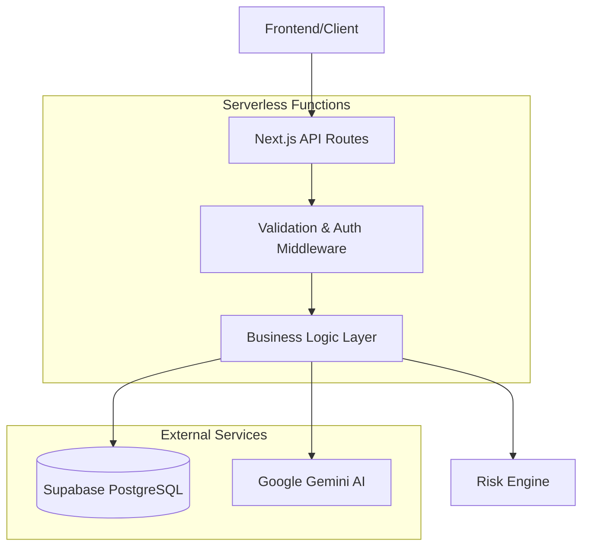

# Design Document

## Overview

The CodeRed Learner Engagement Platform backend is architected as a serverless-first Next.js 14 application using the App Router pattern. The system follows a clean architecture approach with clear separation of concerns between API routes, business logic, data access, and external service integrations. The design prioritizes type safety, performance, and scalability while maintaining simplicity for rapid development and deployment.

## Architecture

### High-Level Architecture



### Serverless Design Principles

1. **Stateless Functions**: All API routes are stateless and can be executed independently
2. **Connection Reuse**: Database connections are reused via globalThis pattern to prevent connection storms
3. **Memory Efficiency**: Cursor-based pagination and chunked processing prevent memory exhaustion
4. **Cold Start Optimization**: Minimal dependencies and lazy loading where possible

### API Route Structure

```
app/api/
├── health/route.ts          # Health check and DB connectivity
├── learners/
│   ├── route.ts            # GET (list) and POST (create) learners
│   └── [id]/
│       ├── route.ts        # GET, PUT, DELETE single learner
│       └── nudge/route.ts  # POST generate nudge for learner
└── simulate/route.ts       # POST batch risk recomputation
```

## Components and Interfaces

### Core Data Models

```typescript
interface Learner {
  id: number;
  name: string;
  email: string;
  completionPct: number;
  quizAvg: number;
  missedSessions: number;
  lastLogin: Date;
  riskScore: number;
  riskLabel: 'low' | 'medium' | 'high';
  createdAt: Date;
  updatedAt: Date;
}

interface Nudge {
  id: number;
  learnerId: number;
  text: string;
  status: 'sent' | 'fallback';
  source: 'gemini' | 'template';
  createdAt: Date;
}

interface PaginatedResponse<T> {
  data: T[];
  nextCursor: number | null;
  hasMore: boolean;
}
```

### Service Layer Interfaces

```typescript
interface RiskEngine {
  computeRiskScore(learner: LearnerLike): number;
  riskLabelFromScore(score: number): string;
}

interface NudgeService {
  buildNudgePrompt(learner: Learner): string;
  streamGemini(prompt: string): Promise<ReadableStream>;
  fallbackNudge(learner: Learner): string;
}

interface DatabaseService {
  getLearners(cursor?: number, limit?: number): Promise<PaginatedResponse<Learner>>;
  createLearner(data: CreateLearnerData): Promise<Learner>;
  updateLearner(id: number, data: UpdateLearnerData): Promise<Learner>;
  deleteLearner(id: number): Promise<void>;
  createNudge(nudgeData: CreateNudgeData): Promise<Nudge>;
}
```

### Middleware Components

1. **Validation Middleware**: Zod-based request body validation with structured error responses
2. **Authentication Middleware**: Admin API key verification for protected endpoints
3. **Error Handling Middleware**: Centralized error normalization and logging

## Data Models

### Database Schema

```sql
-- Learners table
CREATE TABLE learners (
  id SERIAL PRIMARY KEY,
  name VARCHAR(255) NOT NULL,
  email VARCHAR(255) UNIQUE NOT NULL,
  completion_pct DECIMAL(5,2) DEFAULT 0 CHECK (completion_pct >= 0 AND completion_pct <= 100),
  quiz_avg DECIMAL(5,2) DEFAULT 0 CHECK (quiz_avg >= 0 AND quiz_avg <= 100),
  missed_sessions INTEGER DEFAULT 0 CHECK (missed_sessions >= 0),
  last_login TIMESTAMP WITH TIME ZONE DEFAULT NOW(),
  risk_score DECIMAL(5,4) DEFAULT 0 CHECK (risk_score >= 0 AND risk_score <= 1),
  risk_label VARCHAR(10) DEFAULT 'low' CHECK (risk_label IN ('low', 'medium', 'high')),
  created_at TIMESTAMP WITH TIME ZONE DEFAULT NOW(),
  updated_at TIMESTAMP WITH TIME ZONE DEFAULT NOW()
);

-- Nudges table
CREATE TABLE nudges (
  id SERIAL PRIMARY KEY,
  learner_id INTEGER NOT NULL REFERENCES learners(id) ON DELETE CASCADE,
  text TEXT NOT NULL,
  status VARCHAR(20) NOT NULL CHECK (status IN ('sent', 'fallback')),
  source VARCHAR(20) NOT NULL CHECK (source IN ('gemini', 'template')),
  created_at TIMESTAMP WITH TIME ZONE DEFAULT NOW()
);

-- Indexes for performance
CREATE INDEX idx_learners_email ON learners(email);
CREATE INDEX idx_learners_last_login ON learners(last_login);
CREATE INDEX idx_learners_risk_score ON learners(risk_score DESC);
CREATE INDEX idx_nudges_learner_id ON nudges(learner_id);
CREATE INDEX idx_nudges_created_at ON nudges(created_at DESC);
```

### Risk Calculation Model

The risk engine uses a weighted scoring system:

- **Completion Rate** (40%): Normalized 0-1 from completion percentage
- **Quiz Performance** (35%): Normalized 0-1 from quiz average
- **Missed Sessions** (15%): Penalty-based scoring (1 - missed/10, capped at 1)
- **Login Recency** (10%): Time-decay scoring based on days since last login

Final risk score = 1 - weighted_sum (higher score = higher risk)

## Error Handling

### Error Classification

```typescript
class ValidationError extends Error {
  constructor(public details: Record<string, string[]>) {
    super('validation_failed');
  }
}

class NotFoundError extends Error {
  constructor(resource: string, id: string | number) {
    super(`${resource} not found: ${id}`);
  }
}

class AuthError extends Error {
  constructor(message = 'Unauthorized') {
    super(message);
  }
}
```

### Error Response Format

```typescript
interface ErrorResponse {
  error: string;
  message: string;
  details?: Record<string, string[]>;
  timestamp: string;
}
```

### Error Handling Strategy

1. **Validation Errors**: Return 400 with detailed field-level errors
2. **Authentication Errors**: Return 401 with minimal information
3. **Not Found Errors**: Return 404 with resource identification
4. **Server Errors**: Return 500 with sanitized error messages and request IDs for tracking

## Testing Strategy

### Unit Testing

- **Risk Engine**: Test all scoring scenarios including edge cases
- **Validation Schemas**: Test valid and invalid input combinations
- **Utility Functions**: Test helper functions in isolation

### Integration Testing

- **API Endpoints**: Test complete request/response cycles with mocked dependencies
- **Database Operations**: Test CRUD operations with in-memory or test database
- **External Service Integration**: Test with mocked Supabase and Gemini responses

### Testing Tools and Patterns

```typescript
// Example test structure
describe('Risk Engine', () => {
  test('should calculate high risk for poor performance', () => {
    const learner = {
      completionPct: 10,
      quizAvg: 20,
      missedSessions: 8,
      lastLogin: new Date(Date.now() - 30 * 24 * 60 * 60 * 1000) // 30 days ago
    };
    
    const score = computeRiskScore(learner);
    expect(score).toBeGreaterThan(0.66);
    expect(riskLabelFromScore(score)).toBe('high');
  });
});
```

### Mocking Strategy

- **Supabase**: Mock database operations using vi.mock or manual stubs
- **Gemini API**: Mock streaming and non-streaming responses
- **Environment Variables**: Use test-specific environment configuration

## Performance Considerations

### Database Optimization

1. **Cursor Pagination**: Use ID-based cursors for efficient large dataset traversal
2. **Selective Queries**: Only fetch required fields to minimize data transfer
3. **Connection Pooling**: Reuse Supabase client instances across function invocations
4. **Batch Operations**: Process updates in configurable chunks to prevent timeouts

### Caching Strategy

- **Connection Reuse**: Cache database connections via globalThis
- **Computed Values**: Cache risk calculations when learner data hasn't changed
- **Response Caching**: Consider edge caching for read-heavy endpoints

### Memory Management

```typescript
// Example chunked processing pattern
async function processInChunks<T>(
  items: T[],
  chunkSize: number,
  processor: (chunk: T[]) => Promise<void>
): Promise<void> {
  for (let i = 0; i < items.length; i += chunkSize) {
    const chunk = items.slice(i, i + chunkSize);
    await processor(chunk);
  }
}
```

## Security Implementation

### Authentication and Authorization

1. **Admin Protection**: X-Admin-API-Key header validation for destructive operations
2. **Service Role Security**: Keep Supabase service role key server-side only
3. **Input Validation**: Comprehensive Zod schema validation for all inputs
4. **SQL Injection Prevention**: Use parameterized queries through Supabase client

### Data Protection

- **Environment Variables**: Secure storage of API keys and database credentials
- **Error Sanitization**: Prevent sensitive information leakage in error responses
- **CORS Configuration**: Restrict cross-origin requests appropriately
- **Rate Limiting**: Consider implementing rate limiting for production deployment

## External Service Integration

### Supabase Integration

```typescript
// Connection pattern with error handling
const supabaseAdmin = globalThis.__supabase_admin ?? createClient(
  SUPABASE_URL,
  SUPABASE_SERVICE_ROLE_KEY,
  {
    fetch: (input, init) => 
      import('node-fetch').then(({ default: fetch }) => 
        fetch(input as any, init as any)
      )
  }
);
```

### Google Gemini Integration

The design supports both streaming and fallback approaches:

1. **Primary Path**: Attempt streaming via Vertex AI REST endpoints
2. **Fallback Path**: Template-based nudge generation when AI fails
3. **Future Migration**: Comments and structure to support official Google GenAI SDK

```typescript
// Streaming implementation pattern
export async function streamGemini(prompt: string): Promise<ReadableStream> {
  const response = await fetch(vertexEndpoint, {
    method: 'POST',
    headers: { 'Content-Type': 'application/json' },
    body: JSON.stringify({
      instances: [{ content: prompt }],
      parameters: { stream: true, maxOutputTokens: 256 }
    })
  });
  
  return response.body; // Return raw stream for route handling
}
```

## Deployment Architecture

### Vercel Configuration

```json
{
  "functions": {
    "app/api/**/*.ts": {
      "maxDuration": 30
    }
  },
  "rewrites": [
    {
      "source": "/api/(.*)",
      "destination": "/api/$1"
    }
  ]
}
```

### Environment Configuration

Required environment variables:
- `SUPABASE_URL`: Supabase project URL
- `SUPABASE_SERVICE_ROLE_KEY`: Admin access key
- `GEMINI_API_KEY`: Google Cloud API key
- `GEMINI_PROJECT`: Google Cloud project ID
- `ADMIN_API_KEY`: Admin operations authentication
- `RISK_WEIGHT_*`: Optional risk calculation weight overrides

### CI/CD Pipeline

```yaml
# GitHub Actions workflow
name: CI/CD
on: [push, pull_request]
jobs:
  test:
    runs-on: ubuntu-latest
    steps:
      - uses: actions/checkout@v3
      - uses: actions/setup-node@v3
      - run: npm ci
      - run: npm run lint
      - run: npm run typecheck
      - run: npm run test
```

This design provides a robust, scalable, and maintainable foundation for the CodeRed Learner Engagement Platform backend while adhering to serverless best practices and modern development standards.