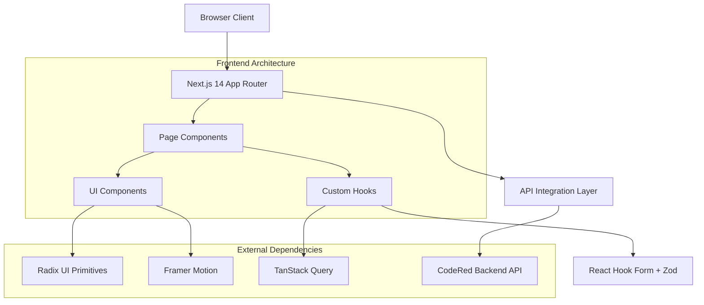

# Design Document

## Overview

The CodeRed Frontend is a modern, serverless-ready Next.js 14 application that provides an intuitive web interface for the CodeRed educational platform. Built with TypeScript and styled with Tailwind CSS, the application follows a component-driven architecture with strong emphasis on accessibility, performance, and user experience. The design draws UX inspiration from upGrad while maintaining original branding and implementing advanced features like real-time AI nudge streaming and efficient data pagination.

## Architecture

### High-Level Architecture



### Technology Stack

- **Framework**: Next.js 14 with App Router and TypeScript
- **Styling**: Tailwind CSS with custom design tokens
- **State Management**: TanStack Query (React Query) for server state
- **Forms**: React Hook Form with Zod validation
- **UI Primitives**: Radix UI for accessible components
- **Animations**: Framer Motion for micro-interactions
- **Charts**: Recharts for data visualization
- **Testing**: Vitest for unit tests, Playwright for E2E

### Design Principles

1. **Accessibility First**: WCAG AA compliance with keyboard navigation and screen reader support
2. **Performance Optimized**: Server components, lazy loading, and efficient caching
3. **Mobile First**: Responsive design with progressive enhancement
4. **Type Safety**: Comprehensive TypeScript coverage with strict mode
5. **Component Isolation**: Single-responsibility components with clear interfaces

## Components and Interfaces

### Core Type Definitions

```typescript
// lib/types.d.ts
interface Learner {
  id: number;
  name: string;
  email: string;
  completionPct: number;
  quizAvg: number;
  missedSessions: number;
  lastLogin: string;
  riskScore: number;
  riskLabel: 'low' | 'medium' | 'high';
  createdAt: string;
  updatedAt: string;
}

interface Nudge {
  id: number;
  learnerId: number;
  text: string;
  status: 'sent' | 'fallback';
  source: 'gemini' | 'template';
  createdAt: string;
}

interface PaginatedResponse<T> {
  data: T[];
  nextCursor: number | null;
  hasMore: boolean;
}

interface NudgeStreamState {
  text: string;
  status: 'idle' | 'streaming' | 'completed' | 'error' | 'cancelled';
  error?: string;
  isFallback?: boolean;
}

interface FilterState {
  search: string;
  riskFilter: 'all' | 'low' | 'medium' | 'high';
  sortBy: 'name' | 'risk' | 'lastLogin';
  sortOrder: 'asc' | 'desc';
}
```

### Component Architecture

```typescript
// Component hierarchy and interfaces
interface ComponentProps {
  // Base props for all components
  className?: string;
  children?: React.ReactNode;
}

interface LearnerCardProps extends ComponentProps {
  learner: Learner;
  isSelected?: boolean;
  onSelect?: (id: number) => void;
  onNudge?: (learner: Learner) => void;
}

interface FilterPanelProps extends ComponentProps {
  filters: FilterState;
  onFiltersChange: (filters: FilterState) => void;
  resultCount: number;
}

interface NudgeModalProps extends ComponentProps {
  learner: Learner | null;
  isOpen: boolean;
  onClose: () => void;
}
```

### Page Components Structure

```
app/
├── layout.tsx              # Root layout with providers
├── page.tsx               # Landing page (Hero + Features)
├── dashboard/
│   └── page.tsx          # Main dashboard with learner grid
├── learners/
│   └── [id]/
│       └── page.tsx      # Individual learner detail
└── admin/
    └── page.tsx          # Admin simulation interface
```

### UI Component Library

```
components/
├── ui/                    # Base UI primitives
│   ├── Button.tsx        # Primary, secondary, ghost variants
│   ├── Input.tsx         # Form input with validation states
│   ├── Modal.tsx         # Radix Dialog wrapper
│   └── Skeleton.tsx      # Loading state components
├── layout/               # Layout components
│   ├── NavBar.tsx        # Responsive navigation
│   ├── Hero.tsx          # Landing page hero section
│   └── Footer.tsx        # Site footer
├── learners/             # Learner-specific components
│   ├── LearnerCard.tsx   # Individual learner display
│   ├── CardGrid.tsx      # Responsive learner grid
│   └── FilterPanel.tsx   # Search and filter controls
├── nudging/              # AI nudging components
│   ├── NudgeModal.tsx    # Streaming nudge interface
│   └── NudgeHistory.tsx  # Previous nudges display
├── charts/               # Data visualization
│   ├── RiskChart.tsx     # Risk distribution chart
│   └── ProgressChart.tsx # Individual progress charts
└── feedback/             # User feedback
    ├── Toaster.tsx       # Toast notifications
    └── ErrorBoundary.tsx # Error handling
```

## Data Models

### API Integration Layer

```typescript
// lib/api.ts - Centralized API client
class ApiClient {
  private baseURL: string;
  
  constructor() {
    this.baseURL = process.env.NEXT_PUBLIC_API_BASE || '/api';
  }
  
  async get<T>(endpoint: string, params?: Record<string, any>): Promise<T> {
    const url = new URL(endpoint, this.baseURL);
    if (params) {
      Object.entries(params).forEach(([key, value]) => {
        if (value !== undefined) url.searchParams.set(key, String(value));
      });
    }
    
    const response = await fetch(url.toString());
    if (!response.ok) throw new ApiError(response);
    return response.json();
  }
  
  async post<T>(endpoint: string, data?: any): Promise<T> {
    const response = await fetch(`${this.baseURL}${endpoint}`, {
      method: 'POST',
      headers: { 'Content-Type': 'application/json' },
      body: data ? JSON.stringify(data) : undefined,
    });
    if (!response.ok) throw new ApiError(response);
    return response.json();
  }
  
  async stream(endpoint: string, data?: any): Promise<ReadableStream> {
    const response = await fetch(`${this.baseURL}${endpoint}`, {
      method: 'POST',
      headers: { 'Content-Type': 'application/json' },
      body: data ? JSON.stringify(data) : undefined,
    });
    if (!response.ok) throw new ApiError(response);
    return response.body!;
  }
}
```

### React Query Integration

```typescript
// lib/hooks/useLearners.ts
export function useLearners(filters: FilterState) {
  return useInfiniteQuery({
    queryKey: ['learners', filters],
    queryFn: ({ pageParam }) => 
      apiClient.get<PaginatedResponse<Learner>>('/learners', {
        cursor: pageParam,
        limit: 20,
        search: filters.search || undefined,
        riskFilter: filters.riskFilter !== 'all' ? filters.riskFilter : undefined,
      }),
    getNextPageParam: (lastPage) => lastPage.nextCursor,
    staleTime: 5 * 60 * 1000, // 5 minutes
    gcTime: 10 * 60 * 1000,   // 10 minutes
  });
}

// lib/hooks/useNudge.ts
export function useNudge() {
  const [state, setState] = useState<NudgeStreamState>({
    text: '',
    status: 'idle'
  });
  
  const startNudge = useCallback(async (learnerId: number) => {
    const abortController = new AbortController();
    setState({ text: '', status: 'streaming' });
    
    try {
      const stream = await apiClient.stream(`/learners/${learnerId}/nudge`);
      const reader = stream.getReader();
      
      while (true) {
        const { done, value } = await reader.read();
        if (done) break;
        
        const chunk = new TextDecoder().decode(value);
        setState(prev => ({ 
          ...prev, 
          text: prev.text + chunk 
        }));
      }
      
      setState(prev => ({ ...prev, status: 'completed' }));
    } catch (error) {
      if (error.name === 'AbortError') {
        setState(prev => ({ ...prev, status: 'cancelled' }));
      } else {
        setState(prev => ({ 
          ...prev, 
          status: 'error', 
          error: error.message 
        }));
      }
    }
    
    return () => abortController.abort();
  }, []);
  
  return { state, startNudge };
}
```

## Error Handling

### Error Classification and Recovery

```typescript
// lib/errors.ts
export class ApiError extends Error {
  constructor(
    public response: Response,
    public data?: any
  ) {
    super(`API Error: ${response.status} ${response.statusText}`);
  }
  
  get isNetworkError() {
    return this.response.status === 0;
  }
  
  get isServerError() {
    return this.response.status >= 500;
  }
  
  get isRateLimited() {
    return this.response.status === 429;
  }
}

// Error boundary implementation
export class ErrorBoundary extends Component<
  { children: ReactNode; fallback: ComponentType<{ error: Error }> },
  { hasError: boolean; error?: Error }
> {
  constructor(props) {
    super(props);
    this.state = { hasError: false };
  }
  
  static getDerivedStateFromError(error: Error) {
    return { hasError: true, error };
  }
  
  componentDidCatch(error: Error, errorInfo: ErrorInfo) {
    console.error('Error boundary caught error:', error, errorInfo);
    // Log to error reporting service
  }
  
  render() {
    if (this.state.hasError) {
      return <this.props.fallback error={this.state.error!} />;
    }
    return this.props.children;
  }
}
```

### Offline and Network Handling

```typescript
// lib/hooks/useNetworkStatus.ts
export function useNetworkStatus() {
  const [isOnline, setIsOnline] = useState(navigator.onLine);
  
  useEffect(() => {
    const handleOnline = () => setIsOnline(true);
    const handleOffline = () => setIsOnline(false);
    
    window.addEventListener('online', handleOnline);
    window.addEventListener('offline', handleOffline);
    
    return () => {
      window.removeEventListener('online', handleOnline);
      window.removeEventListener('offline', handleOffline);
    };
  }, []);
  
  return isOnline;
}

// Retry logic with exponential backoff
export function useRetry() {
  return useCallback(async (
    fn: () => Promise<any>,
    maxRetries = 3,
    baseDelay = 1000
  ) => {
    for (let attempt = 0; attempt <= maxRetries; attempt++) {
      try {
        return await fn();
      } catch (error) {
        if (attempt === maxRetries) throw error;
        
        const delay = baseDelay * Math.pow(2, attempt);
        await new Promise(resolve => setTimeout(resolve, delay));
      }
    }
  }, []);
}
```

## Testing Strategy

### Unit Testing Approach

```typescript
// tests/hooks/useNudge.test.ts
describe('useNudge', () => {
  beforeEach(() => {
    vi.clearAllMocks();
  });
  
  test('should handle streaming nudge generation', async () => {
    const mockStream = new ReadableStream({
      start(controller) {
        controller.enqueue(new TextEncoder().encode('Hello '));
        controller.enqueue(new TextEncoder().encode('world!'));
        controller.close();
      }
    });
    
    vi.mocked(fetch).mockResolvedValueOnce({
      ok: true,
      body: mockStream
    } as Response);
    
    const { result } = renderHook(() => useNudge());
    
    await act(async () => {
      await result.current.startNudge(1);
    });
    
    expect(result.current.state.text).toBe('Hello world!');
    expect(result.current.state.status).toBe('completed');
  });
  
  test('should handle fallback response', async () => {
    vi.mocked(fetch).mockResolvedValueOnce({
      ok: true,
      json: () => Promise.resolve({ text: 'Fallback message', fallback: true })
    } as Response);
    
    const { result } = renderHook(() => useNudge());
    
    await act(async () => {
      await result.current.startNudge(1);
    });
    
    expect(result.current.state.text).toBe('Fallback message');
    expect(result.current.state.isFallback).toBe(true);
  });
});
```

### Integration Testing

```typescript
// tests/integration/dashboard.test.ts
describe('Dashboard Integration', () => {
  test('should load learners and apply filters', async () => {
    const mockLearners = [
      { id: 1, name: 'John Doe', riskLabel: 'high' },
      { id: 2, name: 'Jane Smith', riskLabel: 'low' }
    ];
    
    server.use(
      rest.get('/api/learners', (req, res, ctx) => {
        const riskFilter = req.url.searchParams.get('riskFilter');
        const filtered = riskFilter 
          ? mockLearners.filter(l => l.riskLabel === riskFilter)
          : mockLearners;
        
        return res(ctx.json({ data: filtered, nextCursor: null }));
      })
    );
    
    render(<Dashboard />);
    
    // Wait for initial load
    await waitFor(() => {
      expect(screen.getByText('John Doe')).toBeInTheDocument();
      expect(screen.getByText('Jane Smith')).toBeInTheDocument();
    });
    
    // Apply high risk filter
    fireEvent.click(screen.getByRole('button', { name: /high risk/i }));
    
    await waitFor(() => {
      expect(screen.getByText('John Doe')).toBeInTheDocument();
      expect(screen.queryByText('Jane Smith')).not.toBeInTheDocument();
    });
  });
});
```

### E2E Testing with Playwright

```typescript
// tests/e2e/nudge-flow.spec.ts
test('should generate nudge with streaming', async ({ page }) => {
  // Mock streaming response
  await page.route('/api/learners/*/nudge', async route => {
    const stream = new ReadableStream({
      start(controller) {
        controller.enqueue('Great job on your progress! ');
        setTimeout(() => {
          controller.enqueue('Keep up the excellent work!');
          controller.close();
        }, 100);
      }
    });
    
    await route.fulfill({
      status: 200,
      headers: { 'Content-Type': 'text/plain' },
      body: stream
    });
  });
  
  await page.goto('/dashboard');
  
  // Click on first learner
  await page.click('[data-testid="learner-card"]:first-child');
  
  // Open nudge modal
  await page.click('button:has-text("Generate Nudge")');
  
  // Verify streaming text appears
  await expect(page.locator('[data-testid="nudge-text"]')).toContainText('Great job');
  await expect(page.locator('[data-testid="nudge-text"]')).toContainText('Keep up the excellent work!');
  
  // Verify completion state
  await expect(page.locator('button:has-text("Send Nudge")')).toBeEnabled();
});
```

## Performance Optimization

### Code Splitting and Lazy Loading

```typescript
// Dynamic imports for heavy components
const RiskChart = dynamic(() => import('./RiskChart'), {
  loading: () => <Skeleton className="h-64 w-full" />,
  ssr: false
});

const NudgeModal = dynamic(() => import('./NudgeModal'), {
  loading: () => <div>Loading...</div>
});

// Route-level code splitting
const AdminPage = dynamic(() => import('./admin/page'), {
  loading: () => <PageSkeleton />
});
```

### Caching Strategy

```typescript
// React Query configuration
const queryClient = new QueryClient({
  defaultOptions: {
    queries: {
      staleTime: 5 * 60 * 1000,     // 5 minutes
      gcTime: 10 * 60 * 1000,       // 10 minutes
      retry: (failureCount, error) => {
        if (error instanceof ApiError && error.isServerError) {
          return failureCount < 2;
        }
        return false;
      },
      retryDelay: attemptIndex => Math.min(1000 * 2 ** attemptIndex, 30000),
    },
  },
});

// Prefetching strategy
export function usePrefetchLearner() {
  const queryClient = useQueryClient();
  
  return useCallback((learnerId: number) => {
    queryClient.prefetchQuery({
      queryKey: ['learner', learnerId],
      queryFn: () => apiClient.get(`/learners/${learnerId}`),
      staleTime: 5 * 60 * 1000,
    });
  }, [queryClient]);
}
```

### Bundle Optimization

```javascript
// next.config.js
/** @type {import('next').NextConfig} */
const nextConfig = {
  experimental: {
    optimizePackageImports: ['recharts', 'framer-motion'],
  },
  webpack: (config) => {
    config.optimization.splitChunks = {
      chunks: 'all',
      cacheGroups: {
        vendor: {
          test: /[\\/]node_modules[\\/]/,
          name: 'vendors',
          chunks: 'all',
        },
        charts: {
          test: /[\\/]node_modules[\\/](recharts|d3)[\\/]/,
          name: 'charts',
          chunks: 'all',
        },
      },
    };
    return config;
  },
};
```

## Accessibility Implementation

### ARIA and Semantic HTML

```typescript
// Accessible component patterns
export function LearnerCard({ learner, isSelected, onSelect }: LearnerCardProps) {
  return (
    <article
      className="learner-card"
      role="button"
      tabIndex={0}
      aria-selected={isSelected}
      aria-labelledby={`learner-${learner.id}-name`}
      aria-describedby={`learner-${learner.id}-risk`}
      onKeyDown={(e) => {
        if (e.key === 'Enter' || e.key === ' ') {
          e.preventDefault();
          onSelect?.(learner.id);
        }
      }}
    >
      <h3 id={`learner-${learner.id}-name`}>{learner.name}</h3>
      <div 
        id={`learner-${learner.id}-risk`}
        aria-label={`Risk level: ${learner.riskLabel}`}
      >
        <RiskBadge level={learner.riskLabel} />
      </div>
    </article>
  );
}

// Live region for streaming updates
export function NudgeModal({ learner, isOpen }: NudgeModalProps) {
  const { state } = useNudge();
  
  return (
    <Dialog open={isOpen}>
      <DialogContent aria-labelledby="nudge-title">
        <h2 id="nudge-title">Generate Nudge for {learner?.name}</h2>
        <div
          aria-live="polite"
          aria-atomic="false"
          className="nudge-content"
        >
          {state.text}
        </div>
        {state.status === 'streaming' && (
          <div aria-live="assertive" className="sr-only">
            Generating personalized message...
          </div>
        )}
      </DialogContent>
    </Dialog>
  );
}
```

### Keyboard Navigation

```typescript
// Focus management utilities
export function useFocusTrap(isActive: boolean) {
  const containerRef = useRef<HTMLElement>(null);
  
  useEffect(() => {
    if (!isActive || !containerRef.current) return;
    
    const focusableElements = containerRef.current.querySelectorAll(
      'button, [href], input, select, textarea, [tabindex]:not([tabindex="-1"])'
    );
    
    const firstElement = focusableElements[0] as HTMLElement;
    const lastElement = focusableElements[focusableElements.length - 1] as HTMLElement;
    
    const handleTabKey = (e: KeyboardEvent) => {
      if (e.key !== 'Tab') return;
      
      if (e.shiftKey) {
        if (document.activeElement === firstElement) {
          lastElement.focus();
          e.preventDefault();
        }
      } else {
        if (document.activeElement === lastElement) {
          firstElement.focus();
          e.preventDefault();
        }
      }
    };
    
    document.addEventListener('keydown', handleTabKey);
    firstElement?.focus();
    
    return () => document.removeEventListener('keydown', handleTabKey);
  }, [isActive]);
  
  return containerRef;
}
```

## Design System and Styling

### Tailwind Configuration

```javascript
// tailwind.config.js
module.exports = {
  content: ['./app/**/*.{js,ts,jsx,tsx}', './components/**/*.{js,ts,jsx,tsx}'],
  theme: {
    extend: {
      colors: {
        primary: {
          DEFAULT: '#e63946',
          600: '#c1121f',
          50: '#fef2f2',
        },
        accent: {
          DEFAULT: '#1d3557',
          50: '#f0f4f8',
        },
        surface: '#f7fafc',
        muted: '#6b7280',
      },
      borderRadius: {
        md: '12px',
      },
      boxShadow: {
        card: '0 6px 18px rgba(2,6,23,0.08)',
      },
      fontFamily: {
        sans: ['Inter', 'system-ui', 'sans-serif'],
      },
    },
  },
  plugins: [
    require('@tailwindcss/forms'),
    require('@tailwindcss/typography'),
  ],
};
```

### CSS Custom Properties

```css
/* styles/globals.css */
:root {
  --color-primary: #e63946;
  --color-primary-600: #c1121f;
  --color-accent: #1d3557;
  --color-bg: #ffffff;
  --color-surface: #f7fafc;
  --color-muted: #6b7280;
  --color-text: #111827;
  --radius-md: 12px;
  --shadow-card: 0 6px 18px rgba(2,6,23,0.08);
}

@media (prefers-color-scheme: dark) {
  :root {
    --color-bg: #0f172a;
    --color-surface: #1e293b;
    --color-text: #f1f5f9;
  }
}

/* Focus styles for accessibility */
.focus-visible {
  @apply outline-none ring-2 ring-primary ring-offset-2;
}

/* Animation utilities */
.animate-fade-in {
  animation: fadeIn 0.3s ease-out;
}

@keyframes fadeIn {
  from { opacity: 0; transform: translateY(10px); }
  to { opacity: 1; transform: translateY(0); }
}
```

This comprehensive design provides a solid foundation for building a modern, accessible, and performant CodeRed frontend that integrates seamlessly with the existing backend while delivering an exceptional user experience across all devices and user capabilities.